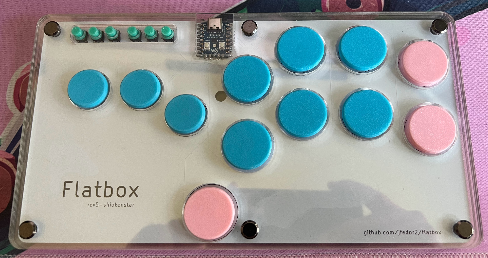
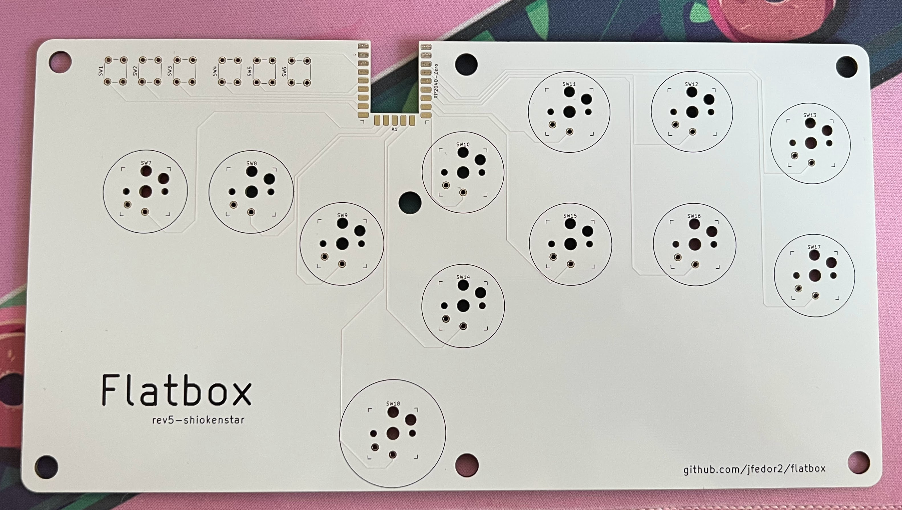
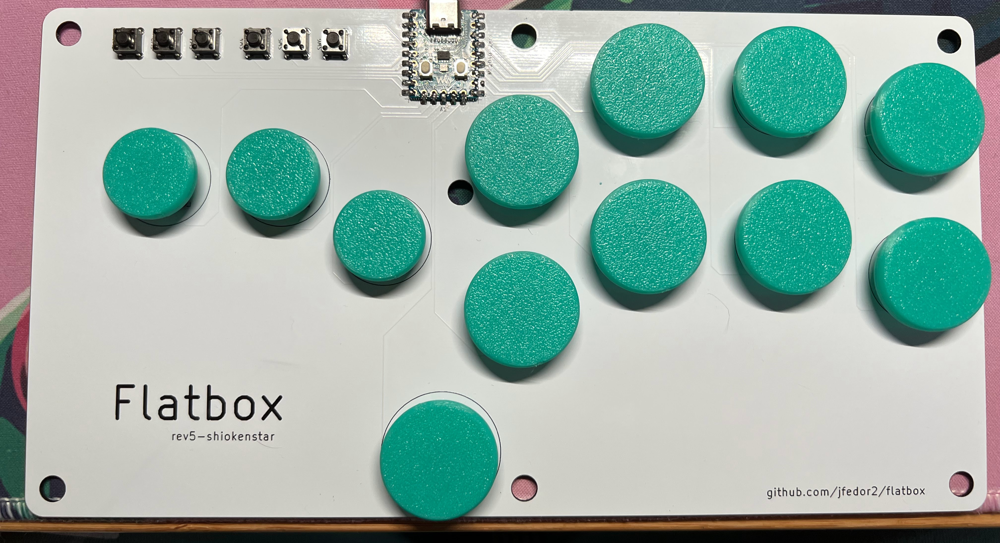
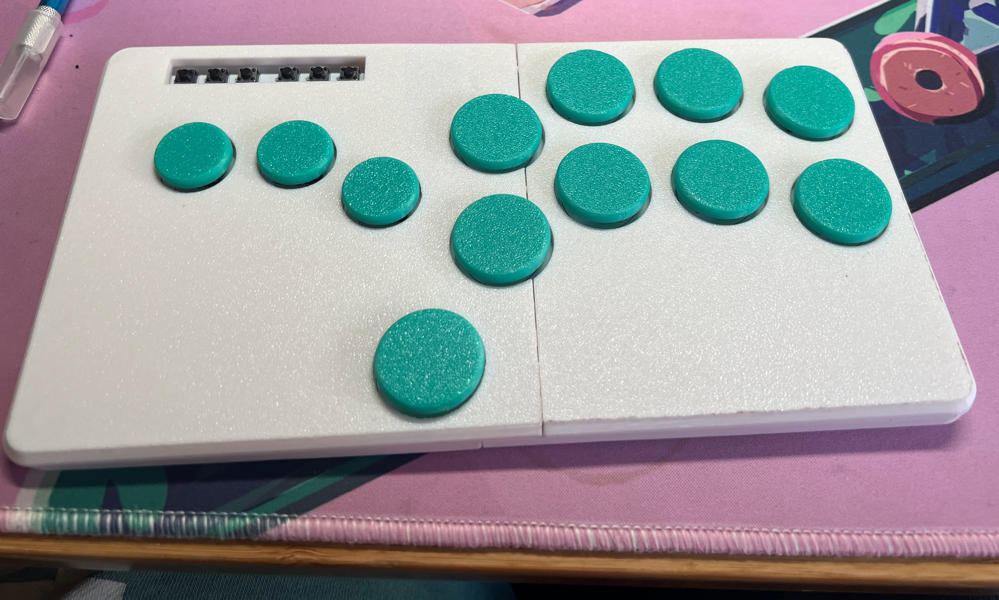

# Flatbox rev5-shk

This is a fork of the flatbox rev5 with changes to button spacing to be closer to a "shiokenstar" layout, which basically just means it uses 30mm attack buttons and spacing closer to what you would see in a standard lever-based arcade controller.

You can follow the instructions in the rev5 folder, just substitute in the relevant files here when ordering your pcb or printing your case.

I've updated the 3d-printed case to work with the new pcb (my printer is small so I had to print each file in 2 pieces so the spacing might not be perfect, ymmv), and also provided the files for a stacked acrylic case. You can send the acrylic file to a laser cutting service (I used Elecrow but they require ordering at least 5 units) to get 5 layers of either 2mm or 3mm acrylic, which you can stack (2 below the pcb, 3 above) and then secure with chicago bolts. I also 3d printed some caps for the acrylic case that sit between the top layer & the tact switches because the tact switches I bought were too short so I've included the model for those as well.

